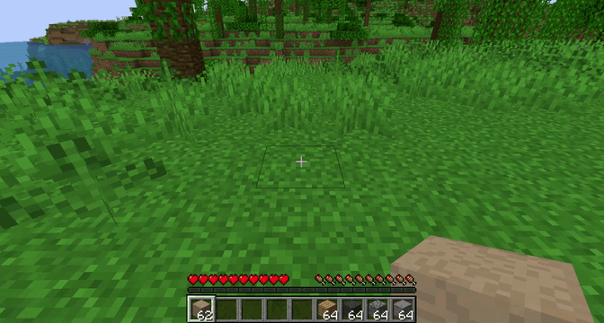

# Cardboard mod
This mod adds only one item: the cardboard block.

Clicking the cardboard block with any block will replace the cardboard block.

This allows you to sketch out a build in cardboard and then replace the cardboard with the final building blocks.

Furthermore, cardboard blocks are instantly breakable, allowing quick iterations on ideas.

## License

MIT licence
